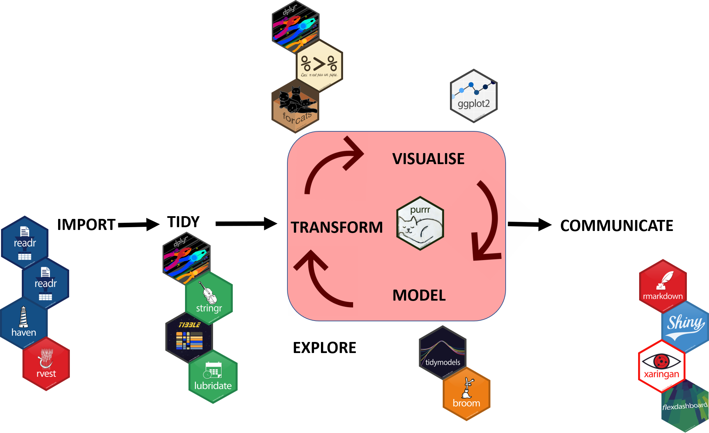
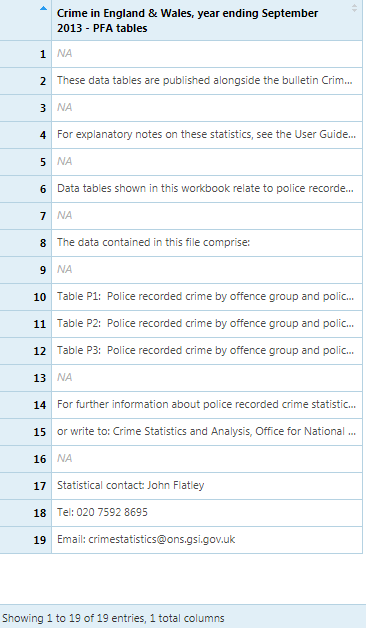
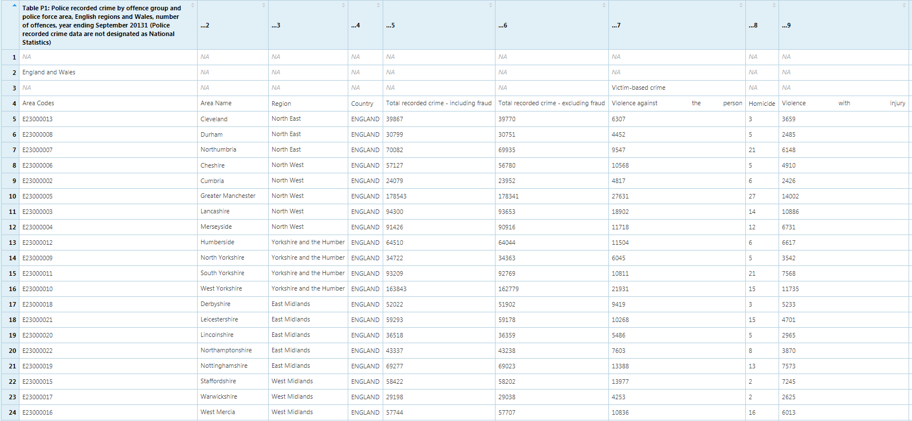

```{r setup, include=FALSE}
knitr::opts_chunk$set(echo = TRUE)

library(kableExtra)
library(lubridate)

```

```{r, echo=FALSE}
htmltools::img(src = knitr::image_uri("../images/dsc_logo.png"),
               alt = 'logo', 
               style = 'position:absolute; top:0; right:0; padding:10px; width:200px;')
```


<br>

# Learning Objectives

  * Learn how to create Projects in RStudio
  * Learn the packages associated with importing and exporting different datasets
  * Learn to tidying column names with janitor
  * Learn to visualise missing data with naniar and visdat
  * Learn to identify and removing duplicates using janitor and dplyr
  * Learn to detect outliers using dplyr and summary.
  * Learn to reshape data using pivot_longer and pivot_wider
  * Learn to arrange data
  * Learn to unite and separate columns using unite and separate
  
  * Learn to create and parse datetime objects using lubridate
  * Learn to adjust the time zone in a date
  


***

<br>

# Projects

It is highly recommended to manage your R work in "projects". When you’re starting work on a new project, choose **‘New project…’** from the File menu and **‘New Directory’** to create a directory for the project.


If you already have data related to the project in an existing directory, you can choose that option instead.


To work on this project in the future, you can select **‘Open Project…’** or **‘Recent Projects’** from the File menu and browse to open the desired project.

This will ensure that your working directory will be set to the project folder, meaning you won’t have to worry about full file paths for data you are reading in or writing to that same folder.


It is good practice to organise your folders. 

As shown in the example below, where you include all files to a project in the same folder `Project A`

<br>


<br>

Within the folder, it is good practice to further organise your files within folders, as shown below.

* The data folder would contain your raw and processed data.

* Images would contain any photos you are using.

* Scripts would contain all the R files. You don't have to stick with this exact folder structure, you could add in additional folders, for example an output folder.

<br>


## Packages for this adventure

Below is a list of the core packages in `tidyverse` and others that we will be using in this session:

* [`readr`](http://readr.tidyverse.org) - Data Import,
* [`tidyr`](https://tidyr.tidyverse.org/) - Data Tidying,
* [`dplyr`](https://dplyr.tidyverse.org/) - General Data Manipulation,
* [`ggplot2`](https://ggplot2.tidyverse.org/) - Data Visualisation

We will also be using
* [`readxl`](http://cran.r-rpoject.org/web/packages/readxl/inde.html) - Data Import,
* [`lubridate`](https://lubridate.tidyverse.org/) - Dates,
* [`janitor`](https://cran.r-project.org/web/packages/janitor/index.html) - Data Cleaning
* [`naniar`](https://cran.r-project.org/web/packages/naniar/index.html) - Visualising Missing Data,
* [`visdat`](https://cran.r-project.org/web/packages/visdat/index.html) - Visualising Missing Data


Other tidyverse packages worth looking into are:

* [`stringr`](https://stringr.tidyverse.org/) - Strings Manipulation,
* [`forcats`](https://forcats.tidyverse.org/) - Factors Manipulation,
* [`purrr`](https://purrr.tidyverse.org/) - Functional Programming


Note: The majority of the 'heavy lifting', with respect to data manipulation and exploration, will be done through the functions available through the `tidyverse` libraries. On some occasions, we will be using functions from other libraries.



For this adventure we'll be using the `tidyverse` meta package in addition to the packages `janitor`, `visdat`, `naniar`, and `lubridate` for data cleaning and working with and visualising missing data.

```{r, messages = FALSE, warning = FALSE}
#install.packages("tidyverse")
#install.packages("janitor")
#install.packages("visdat")
#install.packages("naniar")
#install.packages("lubridate")
#install.pacakges("readxl")

library(tidyverse)
library(janitor)
library(visdat)
library(naniar)
library(lubridate)
library(readxl)


```


# Reading in Data

There are a variety of ways of reading data into R. In introduction to R we covered reading in data using the `readr` package. In this course we will go into more depth on how to usee the `readxl` package and `haven` for loading in data from SPSS, Stata, and SAS.

Beyond these packages, there are also several other options for common file types:

* `haven` - SPSS, Stata and SAS files,
* `DBI` + `dplyr` or `dbplyr` - Databases,
* `jsonlite` - json files,
* `httr` - Web APIs,
* `rvest` - HTML (Web Scraping)

***

<br>


## Readr

The package provides a fast and friendly way to read data from *csv* and *tsv* formats, it converts the data into *tibbles*.

For this section we are going to use the **`read_csv()`** function.

Before importing your data you need to know,

* Where it is stored?

* What kind of file it is?

* Are there any missing values in the data (denoted by `na`).

The code below demonstrates how you can read in csv data.

```{r, eval=FALSE}
# Reading in CSV data using readr package and read_csv function

dataframe_name <- readr::read_csv(file = file_path)
```


<br>

**Things to keep in mind**

`readr` will assume that the first row of your data is the headings of the columns.

`readr` will automatically try and guess the data types in your columns, for example; if a column has only numerical data, it will be classed as numeric or if it only contains logical values it will be classed as logical. If the values do not match then R keeps them as characters. It is good practise to check your column data types, just in case R chose the wrong type automatically.

***

<br>


## Example 

Load the titanic data using the code below.

You will need to change the file path to your location.

You will have noticed that we had some parsing information after reading the file in, displayed at the end of the process (as a warning). This is to let us know the data type  for each column. 

This is not an error and its useful to inspect the chosen datatypes. 

```{r}
# Reading in CSV data using readr package and read_csv function

path <- file.path("../data", "titanic.csv")

titanic <- readr::read_csv(file = path)

```


To look at the data in R we use the `View` command as below.


```{r eval=FALSE}
# Viewing the data using the View() function

View(titanic)
```


## readxl

We use readxl to read excel data into R, it supports both `.xls` and `.xlsx` formats.


The code below demonstrates how you can read excel data.


```{r eval=FALSE}
dataframe_name <- readxl::read_excel(file_path)
```  

One handy thing to know is the **`excel_sheets()`** function.

As excel files often have multiple sheets, this function will provide the names without having to open the file.

We run this function with the code below:


```{r eval=FALSE}
# To find out the excel sheet names from excel file

readxl::excel_sheets(file_path)
```

***

<br>

## Example 


1. Read in the excel file Police data.


```{r, eval = FALSE}

file_path <- file.path("../data", "police_data.xlsx")

police_data <- readxl::read_excel(path = file_path)

```

After reading in the file our data should look like this.

<br>



<br>

This is the first sheet in our excel which is just the `Notes`.


If we dont specify which sheet, the default setting from readxl is to give us the first sheet.

<br>

2. Use the `excel_sheets` function to see the names of the sheets in the police data.


```{r, eval = FALSE}
# finding out the excel sheet names from excel file

readxl::excel_sheets("../data/police_data.xlsx")
```

***

<br>


## Exercise{.tabset .tabset-fade}


### **Exercise**{-}


1. Can you add an additional argument in the `read_excel` function to read in the second sheet (Table P1) from the police data.


**HINT - look at the help documentation, maybe something that talks about "sheet"**

***

<br>


### Show Answer{-}


You can use the name of the sheet or the number/index. 


This would be useful if you have a lot of sheets.

```{r, eval=FALSE}

# Reading in excel data using the readxl package
# and the read_excel function
# assigning the file name police_data
# specifying which sheet to read, here it is the second sheet or Table P1


police_data <- readxl::read_excel("../data/police_data.xlsx",
                                  sheet = 2)

# Alternatively

police_data <- readxl::read_excel("../data/police_data.xlsx",
                                  sheet = "Table P1")

```

Our file should now look like this,

<br>



<br>

As we can see the top columns are mostly blank with no real significant data, to get around this we can add in a range of columns and rows that have the data we want to analyse. This sorts out the column names as well.

<br>

```{r, eval = TRUE}
# Reading in excel data using the readxl package
# and the read_excel function
# assigning the file name police_data
# specifying which sheet to read, here it is the second sheet or Table P1
# specifying the range to only read the cells with data


police_data <- readxl::read_excel("../data/police_data.xlsx",
                                  sheet = 2, 
                                  range = "A5:AA48")

```

<br>

```{r echo=FALSE, message=FALSE, warning=FALSE, eval = TRUE}
police_data %>% 
  kable() %>% 
  kable_styling(bootstrap_options = c("striped", "hover", "condensed")) %>% 
  scroll_box(width = "100", height = "700px")
```

***

<br>


# Exporting the Data

When you read a file into R, the data is loaded into memory. This means that any changes you make won't be reflected in the original file you loaded. If you want to preserve the changes you make to the dataset you have to export the data object to a file.

Exporting tables works in much the same way as importing it.

`readr` allows us to export to csv file type or equivalent using the **`write.csv()`** function.

As an example we will export the police data we just imported.

```{r, eval=FALSE}
# Exporting data using the readr package 
# and write_csv function, we start with file we want to export
# and the the path where we want to export it to

readr::write_csv(police_data, path = "../data/test.csv")
```

Our data frame `police_data` would now be stored as `test.csv` in the `../data/` folder. The `.csv` (comma separated value) files can then be opened in excel or anothe programme of choice.


***

<br>


# Tidying Data


## Tidying up our names using the `janitor` package

The package `janitor` has several useful functions for cleaning data. We can use the function `clean_names` to tidy up our variable names and to ensure that they follow an appropriate naming convention. In this case the default is snake_case, but we can alter this by changing the argument `case = `

```{r}

names(titanic)

titanic <- janitor::clean_names(titanic)

names(titanic)

```


### Prepping the gapminder data

Let's go back to the gapminder data set we've worked with before. First let's load in the data:

```{r}

my_file <- file.path("../data", "gapminder.csv")

gapminder <- read_csv(file = my_file)

```


### Exercise{.tabset .tabset-fade .tabset-fade}


#### **Exercise**{-}


Fill in the blanks to tidy up the names of the gapminder code

```{r, eval = FALSE}

gapminder <- ________(gapminder)

```


***

<br>

#### **Hint**{-}

Take a look above at how we cleaned the names of the titanic dataset using the `janitor` package.

***

<br>

#### **Show Answer**{-}

We can use the function `clean_names()` from the janitor package

```{r}

gapminder <- clean_names(gapminder)

```


***


# Quality assurance

## Missing Data

Missing data is a common occurrence in data science. We can use the packages `naniar` and `visdat` to inspect and visualise our missing data. 

These packages can help us to visualise the types of data we have and to also identify where we have missing data. The `visdata` package provides a visualisation of an entire data frame at once. 


```{r}

vis_dat(titanic)

```

From the plot above, which column is missing the most information?


### Exercise{.tabset .tabset-fade .tabset-fade}


#### **Exercise**{-}


From the plot above, which column is missing the most information?


***

<br>

#### **Hint**{-}

Take a look at the legend and then back to the graph. Which column has the most greyed out observations which represent missing data ("NA")? 

***

<br>

#### **Show Answer**{-}

The variable `cabin` has the most data missing. 


***

<br>

### Percentage of data that is missing

If we want to look at the percentage of data that is missing for each column and overall, we can use the function `vis_miss`

```{r}

vis_miss(titanic)

```

Using `naniar` we can explore missing data further using functions like `gg_miss_var` that work with `ggplot`.

```{r Visualising how many observations are missing}

gg_miss_var(titanic)

```


### Exploring mechanisms of missing data

We can identifying using `vis_miss` the key variables that are missing data, however it is important to explore the relationship amongst the variables in the dataset. 

For example we might wish to explore whether the information we have about cabins is missing for certain fares. We can look to see whether there are any patterns in the data by creating a colour for 

```{r}

titanic %>%
      mutate(
        missing_cabin = is.na(cabin)
      ) %>%
      ggplot(titanic, mapping = aes(fare)) +
        geom_freqpoly(aes(colour = missing_cabin), binwidth = 1/4)

```


# Exploring relationship with missing data (data missing from various sources).


By default, `ggplot` does not handle missing data. This makes it hard to explore and to know where data is missing. This leads to the question "how do you visualise something that is not there"? One approach is to replace "NA" values with values 10% lower than the minimum value in that variable. 


We can visualise what data is missing using

```{r}

vis_dat(gapminder)

```


We will revisit this later on in the data visualisation course but a quick plot we can use is:

```{r}


ggplot(gapminder,
    aes(x = fertility,
        y = infant_mortality)) +
    geom_point(alpha = 0.5)

```

```{r}


ggplot(gapminder,
    aes(x = fertility,
        y = infant_mortality)) +
  geom_miss_point(alpha = 0.5)

```

We may wish to explore by continent

```{r}

ggplot(gapminder,
    aes(x = fertility,
        y = infant_mortality)) +
  geom_miss_point(alpha = 0.5) +
  facet_wrap(~continent)

```


### Exercise{.tabset .tabset-fade .tabset-fade}


#### **Exercise**{-}

Fill in the blank to update the plot code to look at the year.


```{r, eval = FALSE}

ggplot(gapminder,
    aes(x = fertility,
        y = infant_mortality)) +
  geom_miss_point(alpha = 0.5) +
  facet_wrap(~_______)

```


***

<br>

#### **Hint**{-}

Take a look at the example with continent. If we need to check our spelling we can check how year appears in our dataset using `names(gapminder)`

```{r}

names(gapminder)

```


***

<br>

#### **Show Answer**{-}

Just as we did when exploring the missing data by continent, we can do the same with year.

```{r}

ggplot(gapminder,
    aes(x = fertility,
        y = infant_mortality)) +
  geom_miss_point(alpha = 0.5) +
  facet_wrap(~year)

```

What do you notice from the plot?

***


### What to do with missing values

We'll cover what to do with missing values in a later section. First we need to understand the missingness types:

There are three types of missing data:

* **MCAR**: Missing Completely at Random
* **MAR**: Missing at Random
* **MNAR**: Missing Not at Random

The different types of missing have different implications.

|Type   |Imputation   |Deletion   | Visual cues   |
|---|---|---|---|
| MCAR  |Recommended   | Will not lead to bias   |  May lead to bias | Well-defined missingness clusters when arranging for a particular variable(s) |
| MAR  | Recommended | May lead to bias | Well-defined missingness clusters when arranging for a particular variable(s)   |
|  MNAR | Will lead to bias   | Will lead to bias   | Neither visual pattern above holds   |


<!-- You can then look at a dataset with missing values and evaluate the imputation model. This would involve internal evaluation, comparing distributions with and without imputed values (e.g. Mean, Variance, and Scale) and also external evaluation, where you build a model and then evaluate the impact of the imputation method on Machine Learning model performance.  -->

## Detecting unusual data

We can look at all the distinct values for a variable using the verb `distinct`. This can help us identify anything unusual or also see what values come up.

```{r}

titanic %>%
  distinct(sibsp)

```

For numeric variables we can use `summary` to get an idea of the spread of the data

```{r}

summary(titanic)

```

Looking at the output of summary what is the maximum and minimum fare?

### Replacing values

We can replace values using the statement `case_when()`. `case_when()` is a two-sided formula where the left-hand side is a logical condition (yes or no) and the right-hand side is the value to assign when that test is `TRUE`, with the two sides separated by a `~`.

```{r}

titanic %>%
  mutate(survived = 
           case_when(survived == 1 ~ "yes", 
                     survived == 0 ~ "no")
         )

```
If we are given more information, for instance, let's say that we know that the maximum fare for a ticket was 100. We may wish to create a `quality_check` column for fare to identify outliers.

Now values that are not managed by the logical tests get a default replacement value: `NA`. If we prefer these values to not get an `NA` then we can do this by putting `TRUE` on the left hand side and the catch-all value on the right: `TRUE ~ missing`

```{r}

titanic %>%
  mutate(quality_check = case_when(fare > 100 ~ "outlier",
                                   fare <= 100 ~ "keep",
                                    TRUE ~ "missing")
        )

```

A few additional notes about the `case_when`, the left-hand side must evaluate to a logical vector (i.e. can the answer to the logical operation be TRUE or FALSE?). The right-hand side does not need to be logical but it must evaluate to the same type of vector (e.g. all characters, or all numeric). When you search online for code examples, you might also see the `recode` and `ifelse` functions used to carry out similar tasks. 


## Detecting duplicates

Duplicates often creep into our datasets when we combine data from sources or can also accidentally occur during data entry. 

We can use the function `get_dupes` from the R package `janitor` to identify duplicates. We need to specify the data frame (`dat`) and then the variable combination to search for dublicates and get back the duplicated rows.


```{r}
data(mtcars)

janitor::get_dupes(dat = mtcars, mpg, hp)

```

Like other functions that follow `tidyverse` principles. We can also use this function with the pipe.

```{r}

mtcars %>%
  get_dupes(wt)

```

To remove duplicates and included only distinct rows, we can use the verb `distinct`.

```{r}

dim(titanic)

titanic_distinct <- titanic %>%
                        distinct()

```

The verb `distinct` can also work with particular columns, e.g. if we wanted to represent only distinct fare types


```{r}

dim(titanic)

titanic_distinct <- titanic %>%
                        distinct(fare, keep.all = TRUE)

dim(titanic_distinct)

```


# Formatting data in a tidy format


Tabular data is a set of values, where each **value** is placed in its own “cell”, each **variable** in its own column, and each **observation** in its own row. The book [*R for Data Science*](https://r4ds.had.co.nz/) by Garrett Grolemund and Hadley Wickham is a great resource when thinking about tidying data. Here, we use some of the definitions they set out in the book to describe tidy data. 

**Some definitions for tidy data**:

 * A **variable** is a quantity, quality, or property that you can measure.

 * A **value** is the state of a variable when you measure it. The value of a variable may change from measurement to measurement.

 * An **observation** is a set of measurements made under similar conditions (you usually make all of the measurements in an observation at the same time and on the same object). An observation will contain several values, each associated with a different variable.

  * In R, the `dplyr` package makes it easy to format your data in a tabular format. 
  

{width=750px}

### Exercise{.tabset .tabset-fade .tabset-fade}


#### **Exercise**{-}

Take a look at the titanic data.

* What are the variables?
* What is an example of a value?
* What are the observations?


***

<br>

#### **Hint**{-}

Remember that in a tidy data set, **variables** are the columns, a **value** is a cell, and an **observation** is a set of measurments made under similar conditions or related to a certain entity (e.g. in the case of the iris dataset a single flower).

***

<br>

#### **Show Answer**{-}

In this case the **variables** are 

```{r}
names(titanic)
```

A value would be a single value of one of theese variables, e.g. 

```{r}
titanic[1,"name_of_passenger"]
```

And the observation would be all of the information recorded for a single person:

```{r}

titanic %>%
  filter(name_of_passenger == "Allen, Miss. Elisabeth Walton")

```


***


<br>

## Reshaping Data

```{r, echo = FALSE}

current_year <- year(today())

```


Let's go back `r current_year - 2000` years, and take a look at the top billboard top 100 charts in the USA from the year 2000. 


```{r}

data(billboard)

```


```{r echo=FALSE, message=FALSE, warning=FALSE, eval = TRUE}
billboard %>% 
  kable() %>% 
  kable_styling(bootstrap_options = c("striped", "hover", "condensed")) %>% 
  scroll_box(width = "100", height = "700px")
```

Now arranging the data as a table (in a wide-format) is a popular way to collect data as it optimises ease of data entry or ease of comparison. However, this format is not easy to analyse, especially within R which is optimised for vectorised operations (i.e. working with variables in columns).

Luckily there are two handy functions that we can use to **pivot** between the two. We can adjust the shapes of an object in R using the functions `pivot_longer` and `pivot_wider`.

### pivot_longer and pivot_wider

* `pivot_longer()` makes datasets **longer** by increasing the number of rows and decreasing the number of columns.

* `pivot_wider()` "widens" data, increasing the number of columns and decreasing the number of rows. 

The two functions are the inverse transformation of the other. 

Returning to our `billboard` dataset. Here the data encoded in the column names is really a number (which week). In this case we want the names to become a variable called `week`, and the values to become a variable called `rank`, that is what was the ranking of a particular song in a given week. 

```{r}

billboard %>% 
  pivot_longer(
    cols = starts_with("wk"), 
    names_to = "week", 
    values_to = "rank"
  )

```

We can also add additional arguments. For instance, not every song stays in the charts for all 76 weeks, so the structure of the input data forc the creation of unnecessary explicit `NA`s


```{r}

(billboard_long <- billboard %>% 
                    pivot_longer(
                      cols = starts_with("wk"), 
                      names_to = "week", 
                      values_to = "rank",
                      values_drop_na = TRUE 
                    )
)

```

We may also want week to appear as an integer instead of as a character.


```{r}

billboard %>% 
  pivot_longer(
    cols = starts_with("wk"), 
    names_to = "week", 
    names_prefix = "wk", 
    names_transform = list(week = as.integer), 
    values_to = "rank",
    values_drop_na = TRUE,
  )

```


Now if we want to transform the data back we can do this using `pivot_wider`

```{r}

billboard_long %>%
  pivot_wider(
    names_from = week,
    values_from = rank
    )
    


```


Let's take a look at another dataset, relig_income. This dataset was gathered by the Pew Research Center and contains the results from surveys of more than 35,000 Americans from all 50 states.

```{r}
data(relig_income)
```

```{r echo=FALSE, message=FALSE, warning=FALSE, eval = TRUE}
relig_income %>% 
  kable() %>% 
  kable_styling(bootstrap_options = c("striped", "hover", "condensed")) %>% 
  scroll_box(width = "100", height = "700px")
```

In this case the column names are character data that contain the income category. Within the cells are the counts of how many people are in that income range.


### Exercise{.tabset .tabset-fade .tabset-fade}


#### **Exercise**{-}

We wish to reorganise the data so that the names of the columns, the income categories, are contained in a single variable called "income". We want to make it so that the values, the number of people in each category, are contained in a single column called "count".  


```{r, eval = FALSE}
relig_income %>%
  pivot______(
    cols = !religion, # all columns but religion
    names_to = _____,
    values_to = _______)
```


***

<br>

#### **Hint**{-}

To choose the right function, you'll want to think about, are we making our data "longer" or "wider"?

For the other aspects, we have a clue in the text.

We wish to reorganise the data so that the **names** of the columns, the income categories, are contained in a single variable called "income". We want to make it so that the **values**, the number of people in each category, are contained in a single column called "count". 

***

<br>

#### **Show Answer**{-}

```{r}
relig_income %>%
  pivot_longer(
    cols = !religion, # all columns by religion
    names_to = "income",
    values_to = "count")
```

***

### Arranging data

Another one of the dplyr verbs that comes in handy when we want to arrange data is `arrange`.

To order the rows by the values of a column (low to high)

```{r}

titanic %>%
  arrange(fare)

```

To order the rows by the values of a column (high to low).

```{r}

titanic %>%
  arrange(desc(fare))

```

### Separate and unite


Separate and unite are two other functions that are useful for helping organised our data into columns. We can also `separate` one column into several.


```{r}

titanic2 <- titanic %>%
              separate(
                col = name_of_passenger, 
                into = c("last_name", "first_names"), 
                sep = ","
              )


```

Or unite several columns into one.

```{r}

titanic2 %>%
  unite(col = "name_of_passenger", "last_name", "first_names",  sep = ",")

```

# Dates and times with lubridate

```{r, echo=FALSE, out.width=500, fig.align='center'}

knitr::include_graphics("../images/lubridate.png")

```
Artwork by @allison_horst


## Learning objectives

* Learn to create date, time, and date-time objects with **helpers** (e.g. ymd, dmy_hms). 

* Learn to extract components (e.g. year, month, wday) from date-time objects with **accessors**. 

* Learn how to change time zones with `with_tz`

### What makes dates and times so challenging?


* **Physical phenomena**


<a title="Elf Pavlik / CC0" href="https://commons.wikimedia.org/wiki/File:Blue_Marble_rotating.gif"></a>
Blue Marble Rotating by Elf Pavlik

    * Rotation of the Earth
    * Earth's orbit around the sun

* **Geopolitical phenomena**

    * Months, time zones, leap years, and DST
    * The Tzolk'in Mayan calendar had 260 days!
  
  


## Dates and times in R

Type can be
1. A date (`<date>`)
2. A time (`<time>`)
3. A date-time (`<dttm>`) a date plus time. 


Can be built from

* Strings: 09/10/2010
* Existing date/time objects
* Date-time components (year = 1990, month = 12, day = 4)


### Parsing dates and times using helpers


```{r, echo=FALSE, out.width=600, fig.align='center'}

knitr::include_graphics("../images/lubridate_ymd.png")

```

Artwork by @allison_horst


* Identify the order in which the year (`y`), month (`m`), and day (`d`) appears in your dates.

* Let's look at October 2, 2020.

```{r}

ymd("20201002")

```

### Exercise{.tabset .tabset-fade .tabset-fade}


#### **Exercise**{-}

Fill in the appropriate helper for the date: October 2, 2020 based on the order in which the year (`y`), month (`m`), and day (`d`) appears in your dates.

```{r, eval= FALSE}

___("10-02-2020")

```

***

<br>

#### **Hint**{-}

Look back a the original example. In this case 10 is the month, 02 is the day, and 2020 is the year. What order to they occur in here? What helper letter is used for each part? 

```{r, eval= FALSE}

___("10-02-2020")

```


***

<br>

#### **Show Answer**{-}

The order October 2, 2020 occurs in is month (m), day (d), and then year (y).

```{r, eval= TRUE}

mdy("10-02-2020")

```


* For date-times, we can add an underscore and one of more `h` `m` and `s` to our parsing function.


### Exercise{.tabset .tabset-fade .tabset-fade}


#### **Exercise**{-}

* What helper would we use for October 3, 2020 if it comes in this format?

```{r, eval = FALSE}

____("03/10/20 15:32:05")

```

***

<br>

#### **Hint**{-}

* We first need to specify the order that the day, month, and year occur. Then the order in which the hours, minutes, and seconds occur. The two will be separated by and underscore "_". In this case it will start with "dmy_"

```{r, eval = FALSE}

____("03/10/20 15:32:05")

```


***

<br>

#### **Show Answer**{-}

* The order is day `d`, month `m`, and year `y`. We then need to add an underscore `_`. Then for the time it is hour `h`, `m`, and `s`. 

```{r, eval = FALSE}

dmy_hms("03/10/20 15:32:05")

```


Times are supplied in `UTC`, the coordinated universal time, unless we specify a time zone (tz). 


### Dealing with Time Zones

A tale of 5 time zones...

Let's take a look at our training schedule 

```{r}

training_path <- file.path("../data", "training_schedule.xlsx")
schedule <- read_xlsx(training_path)

schedule <- schedule %>%
              mutate(date = as_datetime(date))

```

```{r, echo = FALSE}
schedule %>% kable() %>% 
  kable_styling(bootstrap_options = c("striped", "hover", "condensed")) %>% 
  scroll_box(width = "100", height = "700px")
```


### Getting components

We can pull out individual parts of a date with the **accessor** functions:

- year, month, day
- mday, yday, wday
- hour, minute, second

```{r, eval = FALSE}

schedule %>%
  mutate(year = year(date)) %>%
  head()

```

```{r, echo = FALSE}

schedule %>%
  mutate(year = year(date)) %>%
  head() %>% kable() %>% 
  kable_styling(bootstrap_options = c("striped", "hover", "condensed")) %>% 
  scroll_box(width = "100", height = "700px")

```


### Exercise{.tabset .tabset-fade .tabset-fade}


#### **Exercise**{-}

* Fill in the blank to determine what day of the week our courses fall on

```{r, eval = FALSE}

schedule %>%
  mutate(weekday = ____(date)) 

```

***

<br>

#### **Hint**{-}

* It's not `week()`. It's similar to `mday()` which extracts the day of the month

```{r, eval = FALSE}

schedule %>%
  mutate(weekday = ____(date)) 

```

***

<br>

#### **Show Answer**{-}

* The **accessor** function we are using is `wday()`. We can add the arguments label = TRUE, abbr = FALSE to `wday()` to get the full name of the week day. 

```{r, eval = FALSE}

schedule %>%
  mutate(weekday = wday(date, label = TRUE, abbr = FALSE)) 


```


```{r, echo = FALSE}

schedule %>%
  mutate(weekday = wday(date, label = TRUE, abbr = FALSE)) %>% kable() %>% 
  kable_styling(bootstrap_options = c("striped", "hover", "condensed")) %>% 
  scroll_box(width = "100", height = "700px")


```


### Creating a date time from date-time components

We can create a date-time by combining our date and start-time

```{r}

schedule <- schedule %>%
              mutate(
                start_date_time = make_datetime(
                  year = year(date), 
                  month = month(date), 
                  day = day(date), 
                  hour = start_time, 
                  tz = "Europe/London")
                )


```

* We can create the date time by extract the key parts of the date using `year()`, `month()`, and `day()` from the date. 
* We can also extract the `hour()` from the `start_time()`. 

### Changing timezones with `with_tz`

* But what is the time in Jamaica?

* We can change the time zone using by specifying the time zone we're interested using the argument `tz`. 

```{r}

schedule <- schedule %>%
              mutate(start_date_time_jam = with_tz(
                start_date_time, 
                tz = "America/Jamaica")
                )

```


### Exercise{.tabset .tabset-fade .tabset-fade}


#### **Exercise**{-}

* Try changing the country to Belize. 

Run `OlsonNames(tzdir = NULL)` first to find the correct time zone for Belize.
 

```{r, eval = FALSE}

OlsonNames(tzdir = NULL)

schedule <- schedule %>%
              mutate(start_date_time_bz = with_tz(
                start_date_time, 
                tz = _______)
                )

```

***

<br>

#### **Hint**{-}

* Look under the "America" for Belize in the `OlsonNames()`. And don't forget the quotes.

```{r, eval = FALSE}

OlsonNames(tzdir = NULL)

schedule <- schedule %>%
              mutate(start_date_time_bz = with_tz(
                start_date_time, 
                tz = _______)
                )

```

***

<br>

#### **Show Answer**{-}

* The appropriate `OlsonNames` time zone is "America/Belize". 

```{r, eval = TRUE}

schedule <- schedule %>%
              mutate(start_date_time_bz = with_tz(
                start_date_time, 
                tz = "America/Belize")
                )

```


### Combining lubridate with the filtering


Fill in the blanks to find out which dates the delegates from Belize get to sleep in?

### Exercise{.tabset .tabset-fade .tabset-fade}


#### **Exercise**{-}

* Fill in the blanks to find out which dates the delegates from Belize get to sleep in (i.e. no meetings before 8am!)?
 

```{r, eval = FALSE}


schedule %>%
  filter(______(start_date_time_bz) > 7) %>%
  select(start_date_time_bz)

```

***

<br>

#### **Hint**{-}


* What accessor function would you use to extract the `hour`?


```{r, eval = FALSE}

schedule %>%
  filter(______(start_date_time_bz) > 7) %>%
  select(start_date_time_bz)

```

***

<br>

#### **Show Answer**{-}

* Fill in the blanks to find out which dates the delegates from Belize get to sleep in (i.e. no meetings before 8am!)?


```{r, eval = TRUE}

schedule %>%
  filter(hour(start_date_time_bz) > 7) %>%
  select(start_date_time_bz)

```


### Lubridate Concept Map Recap


 


***

# Acknowledgements

***

Thank you the Office for National Statistics (ONS) Learning Academy (Ian Banda) for letting us include the projects and importing and exporting sections and for the titanic data examples.

*** 
 
