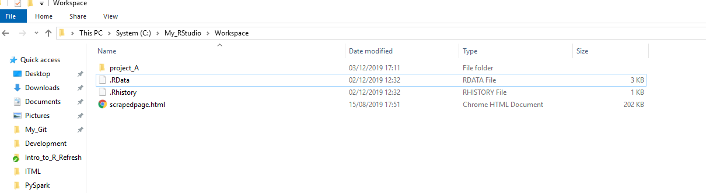
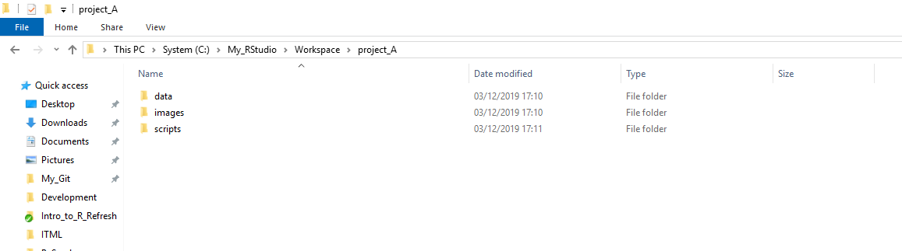
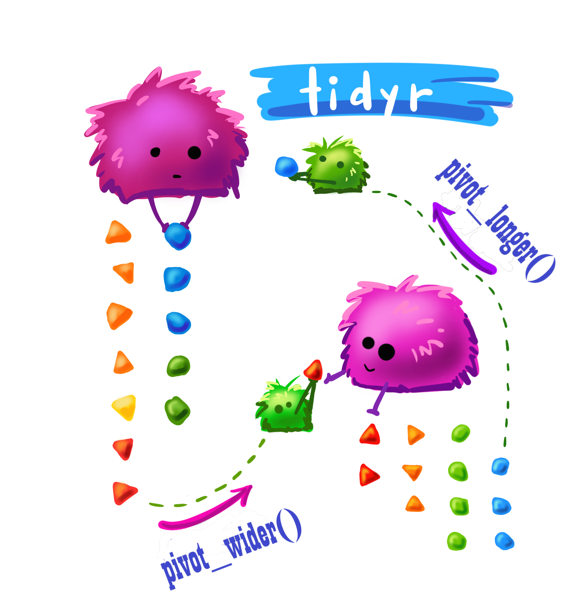

```{r libraries, results='hide', message=FALSE, echo = FALSE, warning=FALSE}

#install.packages("tidyverse")
#install.packages("readxl")
#devtools::install_github("gadenbuie/xaringanExtra")


library(tidyverse)
library(readxl)
library(lubridate)
library(xaringanExtra)
library(countdown)
library(kableExtra)

xaringanExtra::use_xaringan_extra(include = c("panelset", "tile_view", "share_again", "use_broadcast"))

xaringanExtra::style_share_again(share_buttons = c("twitter", "linkedin", "pocket"))

```


```{r xaringan-themer, include=FALSE, warning=FALSE}


library(xaringanthemer)
style_duo_accent(
  primary_color = "#23395b",
  secondary_color = "#f48d23",
  inverse_header_color = "#f48d23"
)

```


class: title-slide, center, bottom


# `r rmarkdown::metadata$title`


```{r, echo=FALSE, out.width=500, fig.align='center'}

knitr::include_graphics("images/data_cowboy.png")

```

### `r rmarkdown::metadata$author`

#### `r rmarkdown::metadata$institute`

Artwork by @allisonhorst


---

# Course Overview

* The beginning
  * Creating Projects in RStudio
  * Recap: Importing and Exporting Data

--

* Tidying and quality checking: 
  * tidying column names
  * missing data
  * removing duplicates
  * detecting outliers
  
--
  
* Reshaping Data
  * pivot_longer, pivot_wider
  * arranging data
  * unite and separate
  
--

* Dates and times with lubridate.
  

---
# For this adventure: packages

```{r, warning = FALSE, message = FALSE}
#install.packages("tidyverse")
#install.packages("janitor")
#install.packages("visdat")
#install.packages("naniar")
#install.packages("lubridate")

library(tidyverse)
library(janitor)
library(visdat)
library(naniar)
library(lubridate)

```

---
# For this adventure: datasets


* `titanic`: fate of passengers on the fatal maiden voyage of the ocean liner ‘Titanic’.
* `police_data`: ONS UK Crime Data from 2013
* `gapminder`: Gapminder foundation
* `billboard`: Billboard music charts
* `relig_income`: Pew research
  


---
# Projects

* Manage your work as projects

* Choose **‘New project…’** from the File menu and **‘New Directory’** to create a directory for the project.

* To work on this project in the future, you can select **‘Open Project…’** or **‘Recent Projects’** from the File menu.





* Benefit: your working directory will always be set to the project folder -> no need to worry about file paths.

???
As shown in the example below, where you include all files to a project in the same folder `Project A`


---
# Projects: file organisation

* **Data** containing your raw and processed data.

* **Images** containing photos you are using.

* **Scripts** containing all the R script files.



???

Within the folder, it is good practice to further organise your files within folders, as shown below.

---
# Importing Data

Before importing your data you need to know,

* Where it is stored?

* What kind of file it is?

* Are there any missing values in the data (denoted by `na`).

---
# File type

There are a variety of ways of reading data into R:

* `readr` - read csv, tsv

--

* `readxl` - excel, xlsx

--

* `haven` - SPSS, Stata and SAS files,

--

* `DBI` + `dplyr` or `dbplyr` - Databases,

--

* `jsonlite` - json files,

--

* `httr` - Web APIs,

--

* `rvest` - HTML (Web Scraping)

---
# Reading in a csv

```{r}

path <- file.path("../data", "titanic.csv")

titanic <- readr::read_csv(file = path)

```

---
# readxl

* Reads excel data into R (both `.xls` and `.xlsx`) formats.


```{r, eval = TRUE}

file_path <- file.path("../data", "police_data.xlsx")

police_data <- readxl::read_excel(path = file_path)

```


```{r echo=FALSE, message=FALSE, warning=FALSE, eval = TRUE}
police_data %>% 
  kable() %>% 
  kable_styling(bootstrap_options = c("striped", "hover", "condensed")) %>% 
  scroll_box(width = "100", height = "700px")
```
  

---
# readxl: dealing with multiple sheets

* the `excel_sheets()` function provides the names of the sheets without having to open the file.

```{r, eval=TRUE}
# To find out the excel sheet names from excel file

readxl::excel_sheets(file_path)
```

---
# Your Turn


1. Add an additional argument in the `read_excel` function to read in the second sheet (Table P1) from the police data.

```{r, eval = FALSE}

police_data <- read_excel(
  path = file_path, 
  _______ = _______)
```

Hint: Look at the help documentation by typing in ?read_excel, is there an argument that talks about "sheet"?

`r countdown(minutes = 5, seconds = 00)` 


---
# Answers

```{r, eval = FALSE}

police_data <- readxl::read_excel(path = file_path, 
                                  sheet = 2)

```

### OR

```{r, eval = TRUE, message = FALSE, warning = FALSE}

police_data <- readxl::read_excel(path = file_path, 
                                  sheet = "Table P1")

```


---
# Specifying a cell range

* The police data still has lots of blank rows at the top. To get rid of this we can specify a cell range. 

```{r echo=FALSE, message=FALSE, warning=FALSE, eval = TRUE}
police_data %>% 
  kable() %>% 
  kable_styling(bootstrap_options = c("striped", "hover", "condensed")) %>% 
  scroll_box(width = "100", height = "700px")
```
  

---
# Specifying a cell range


```{r, eval = TRUE}


police_data <- readxl::read_excel(path = file_path,
                                  sheet = 2, 
                                  range = "A5:AA48")


```

```{r echo=FALSE, message=FALSE, warning=FALSE, eval = TRUE}
police_data %>% 
  kable() %>% 
  kable_styling(bootstrap_options = c("striped", "hover", "condensed")) %>% 
  scroll_box(width = "100", height = "700px")
```

---
# Exporting the Data

* `readr` allows us to export to csv file type or equivalent using the **`write.csv()`** function.

As an example we will export the police data we just imported.

```{r, eval=FALSE}

export_path <- file.path("../data", "test.csv")
readr::write_csv(police_data, path = export_path)

```

---
# Tidying and quality-checking data

```{r, echo=FALSE, out.width=600, fig.align='center'}

knitr::include_graphics("images/janitor_clean_names.png")

```
Artwork by @allison_horst

---
# Tidying up names using the `janitor` package


```{r}

names(titanic)

titanic <- janitor::clean_names(titanic)

names(titanic)

```

---
# Missing Data

```{r}

visdat::vis_dat(titanic)

```

From the plot above, which column is missing the most information?

---
# Missing data: percentage missing

```{r}

visdat::vis_miss(titanic)

```

---
# Missing Data: How many are missing?

* Using `naniar` we can explore missing data further using functions like `gg_miss_var` that work with `ggplot`.

```{r Visualising how many observations are missing}

naniar::gg_miss_var(titanic)

```

---
# Missing data: exploring the mechanisms

* Are we missing the cabin for certain fares more?
* Using `is.na()` to create a colour. 

```{r. eval = FALSE}

titanic %>%
      mutate(
        missing_cabin = is.na(cabin)
      ) %>%
      ggplot(titanic, mapping = aes(fare)) +
        geom_freqpoly(aes(colour = missing_cabin), binwidth = 1/4)

```

---
# Missing data: exploring the mechanisms


```{r, eval = TRUE, echo = FALSE}

titanic %>%
      mutate(
        missing_cabin = is.na(cabin)
      ) %>%
      ggplot(titanic, mapping = aes(fare)) +
        geom_freqpoly(aes(colour = missing_cabin), binwidth = 1/4)

```


---
# Prepping the gapminder data

Before we answer that, let's 

* load the gapminder data

```{r, message = FALSE}

my_file <- file.path("../data", "gapminder.csv")

gapminder <- read_csv(file = my_file)

names(gapminder)
```

* clean it 

```{r}

gapminder <- clean_names(gapminder)

names(gapminder)

```

---
# Prepping the gapminder data

```{r}

visdat::vis_dat(gapminder)

```

---
# Missing data: the *missing* relationship 


```{r, eval }

ggplot(gapminder,
    aes(x = fertility,
        y = infant_mortality)) +
    geom_point(alpha = 0.5)

```

* By default, `ggplot` does not handle missing data. 

--

* This makes it hard to explore and to know where data is missing.

---
# Visualising something that's not there


```{r}

ggplot(gapminder,
    aes(x = fertility,
        y = infant_mortality)) +
  geom_miss_point(alpha = 0.5) #<<

```

???

* Replace "NA" values with values 10% lower than the minimum value in that variable. 


---
# Types of missing data

There are three types of missing data:

* **MCAR**: Missing Completely at Random

--

* **MAR**: Missing at Random

--

* **MNAR**: Missing Not at Random

--

The different types of missing have different implications.

???
--

|Type   |Imputation   |Deletion   | Visual cues   |
|---|---|---|---|
| MCAR  |Recommended   | Will not lead to bias   |  May lead to bias | Well-defined missingness clusters when arranging for a particular variable(s) |
| MAR  | Recommended | May lead to bias | Well-defined missingness clusters when arranging for a particular variable(s)   |
|  MNAR | Will lead to bias   | Will lead to bias   | Neither visual pattern above holds   |


---
# Missing data: exploring patterns


```{r}

ggplot(gapminder,
    aes(x = fertility,
        y = infant_mortality)) +
  geom_miss_point(alpha = 0.5) +
  facet_wrap(~continent) #<<

```

---
# Your Turn

Fill in the blank to update the plot code to look at the year.

```{r, eval = FALSE}

ggplot(gapminder,
    aes(x = fertility,
        y = infant_mortality)) +
  geom_miss_point(alpha = 0.5) +
  facet_wrap(~_______)

```

---
# Answer

```{r, eval = TRUE}

ggplot(gapminder,
    aes(x = fertility,
        y = infant_mortality)) +
  geom_miss_point(alpha = 0.5) +
  facet_wrap(~year) #<<

```

---
# Detecting unusual data

We can look at all the distinct values for a variable using the verb `distinct`. 

```{r}

titanic %>%
  distinct(sibsp)

```

???

This can help us identify anything unusual or also see what values come up.

---
# Detecting unusual data

For numeric variables we can use `summary` to get an idea of the spread of the data

```{r}

summary(titanic)

```

Looking at the output of summary what is the maximum and minimum fare?

---
# Replacing values

* Replacing values using the statement `case_when()`. 

--


```{r}

titanic %>%
  mutate(survived = 
           case_when(survived == 1 ~ "yes", 
                     survived == 0 ~ "no")
         )

```

???


* `case_when()` is a two-sided formula where the left-hand side is a logical condition (yes or no) and the right-hand side is the value to assign when that test is `TRUE`, with the two sides separated by a `~`.


---
# Replacing values

* We may use `case_when()` to create a `quality_check` column.

```{r}

titanic %>%
  mutate(quality_check = case_when(fare > 100 ~ "outlier",
                                   fare <= 100 ~ "keep",
                                    TRUE ~ "missing") #<<
        )

```


* Values not managed by the logical tests get a default replacement value: `NA`.

* If we prefer these values to not get an `NA` then we can use `TRUE ~ missing`

???
do this by putting `TRUE` on the left hand side and the catch-all value on the right:

---
# Detecting duplicates

* Combining data, data entry mistakes.

--

We can use the function `get_dupes` from the R package `janitor` to identify duplicates. We need to specify the data frame (`dat`) and then the variable combination to search for dublicates and get back the duplicated rows.


```{r}

data(mtcars)

janitor::get_dupes(dat = mtcars, mpg, hp)

```

--

```{r}

mtcars %>%
  get_dupes(wt)

```

???

Duplicates often creep into our datasets when we combine data from sources or can also accidentally occur during data entry. 

Like other functions that follow `tidyverse` principles. We can also use this function with the pipe.

---
# Removing duplicates

To remove duplicates and included only distinct rows, we can use the verb `distinct`.

```{r}

dim(titanic)

titanic_distinct <- titanic %>%
                        distinct()

dim(titanic_distinct)

```

--

* `distinct` can also work with particular columns, e.g. if we wanted to represent only distinct fare types.


```{r}

dim(titanic)

titanic_distinct <- titanic %>%
                        distinct(fare, keep.all = TRUE)

dim(titanic_distinct)

```

---
# Reshaping Data


```{r, echo=FALSE, out.width=350, fig.align='center'}



```
Artwork by @allison_horst

---
# Formatting data in a tidy format

Tidy data as defined in [*R for Data Science*](https://r4ds.had.co.nz/):

 * A **variable** is a quantity, quality, or property that you can measure.

 * A **value** is the state of a variable when you measure it. The value of a variable may change from measurement to measurement.

 * An **observation** is a set of measurements made under similar conditions (you usually make all of the measurements in an observation at the same time and on the same object). An observation will contain several values, each associated with a different variable.
 

{width=750px}

### Exercise{.tabset .tabset-fade .tabset-fade}


#### **Exercise**{-}

Take a look at the titanic data.

* What are the variables?
* What is an example of a value?
* What are the observations?


***

<br>

#### **Hint**{-}

Remember that in a tidy data set, **variables** are the columns, a **value** is a cell, and an **observation** is a set of measurments made under similar conditions or related to a certain entity (e.g. in the case of the iris dataset a single flower).

***

<br>

#### **Show Answer**{-}

In this case the **variables** are 

```{r}
names(titanic)
```

A value would be a single value of one of theese variables, e.g. 

```{r}
titanic[1,"name_of_passenger"]
```

And the observation would be all of the information recorded for a single person:

```{r}

titanic %>%
  filter(name_of_passenger == "Allen, Miss. Elisabeth Walton")

```


***


<br>

## Reshaping Data

```{r, echo = FALSE}

current_year <- year(today())

```


Let's go back `r current_year - 2000` years, and take a look at the top billboard top 100 charts in the USA from the year 2000. 


```{r}

data(billboard)

```


```{r echo=FALSE, message=FALSE, warning=FALSE, eval = TRUE}
billboard %>% 
  kable() %>% 
  kable_styling(bootstrap_options = c("striped", "hover", "condensed")) %>% 
  scroll_box(width = "100", height = "700px")
```

Now arranging the data as a table (in a wide-format) is a popular way to collect data as it optimises ease of data entry or ease of comparison. However, this format is not easy to analyse, especially within R which is optimised for vectorised operations (i.e. working with variables in columns).

Luckily there are two handy functions that we can use to **pivot** between the two. We can adjust the shapes of an object in R using the functions `pivot_longer` and `pivot_shorter`.

### pivot_longer and pivot_shorter

* `pivot_longer()` makes datasets **longer** by increasing the number of rows and decreasing the number of columns.

* `pivot_wider()` "widens" data, increasing the number of columns and decreasing the number of rows. 

The two functions are the inverse transformation of the other. 

Returning to our `billboard` dataset. Here the data encoded in the column names is really a number (which week). In this case we want the names to become a variable called `week`, and the values to become a variable called `rank`, that is what was the ranking of a particular song in a given week. 

```{r}

billboard %>% 
  pivot_longer(
    cols = starts_with("wk"), 
    names_to = "week", 
    values_to = "rank"
  )

```

We can also add additional arguments. For instance, not every song stays in the charts for all 76 weeks, so the structure of the input data forc the creation of unnecessary explicit `NA`s


```{r}

(billboard_long <- billboard %>% 
                    pivot_longer(
                      cols = starts_with("wk"), 
                      names_to = "week", 
                      values_to = "rank",
                      values_drop_na = TRUE 
                    )
)

```

We may also want week to appear as an integer instead of as a character.


```{r}

billboard %>% 
  pivot_longer(
    cols = starts_with("wk"), 
    names_to = "week", 
    names_prefix = "wk", 
    names_transform = list(week = as.integer), 
    values_to = "rank",
    values_drop_na = TRUE,
  )

```


Now if we want to transform the data back we can do this using `pivot_shorter`

```{r}

billboard_long %>%
  pivot_wider(
    names_from = week,
    values_from = rank
    )
    


```


Let's take a look at another dataset, relig_income. This dataset was gathered by the Pew Research Center and contains the results from surveys of more than 35,000 Americans from all 50 states.

```{r}
data(relig_income)
```

```{r echo=FALSE, message=FALSE, warning=FALSE, eval = TRUE}
relig_income %>% 
  kable() %>% 
  kable_styling(bootstrap_options = c("striped", "hover", "condensed")) %>% 
  scroll_box(width = "100", height = "700px")
```

In this case the column names are character data that contain the income category. Within the cells are the counts of how many people are in that income range.


### Exercise{.tabset .tabset-fade .tabset-fade}


#### **Exercise**{-}

We wish to reorganise the data so that the names of the columns, the income categories, are contained in a single variable called "income". We want to make it so that the values, the number of people in each category, are contained in a single column called "count".  


```{r, eval = FALSE}
relig_income %>%
  pivot______(
    cols = !religion, # all columns by religion
    names_to = _____,
    values_to = _______)
```


***

<br>

#### **Hint**{-}

To choose the right function, you'll want to think about, are we making our data "longer" or "wider"?

For the other aspects, we have a clue in the text.

We wish to reorganise the data so that the **names** of the columns, the income categories, are contained in a single variable called "income". We want to make it so that the **values**, the number of people in each category, are contained in a single column called "count". 

***

<br>

#### **Show Answer**{-}

```{r}
relig_income %>%
  pivot_longer(
    cols = !religion, # all columns by religion
    names_to = "income",
    values_to = "count")
```

***

### Arranging data

Another one of the dplyr verbs that comes in handy when we want to arrange data is `arrange`.

To order the rows by the values of a column (low to high)

```{r}

titanic %>%
  arrange(fare)

```

To order the rows by the values of a column (high to low).

```{r}

titanic %>%
  arrange(desc(fare))

```


We can also `separate` one column into several.


```{r}

titanic2 <- titanic %>%
              separate(
                col = name_of_passenger, 
                into = c("last_name", "first_names"), 
                sep = ","
              )


```

Or unite several columns into one.

```{r}

titanic2 %>%
  unite(col = "name_of_passenger", "last_name", "first_names",  sep = ",")

```


---


```{r, echo=FALSE, out.width=350, fig.align='center'}

knitr::include_graphics("images/lubridate.png")

```
Artwork by @allison_horst


---

# You

* Are familiar with R, Rmarkdown notebooks, and dplyr. 

* Are new to working with dates and times in R

* Want to learn easy ways to extract information from dates and times. 

```{r, echo=FALSE, out.width=350, fig.align='center'}

knitr::include_graphics("images/lubridate.png")

```
Artwork by @allison_horst


---
# Learning objectives

* Learn to create date, time, and date-time objects with **helpers** (e.g. ymd, dmy_hms). 

* Learn to extract components (e.g. year, month, wday) from date-time objects with **accessors**. 

* Learn how to change time zones with `with_tz`

---
# Getting started


* For this adventure you'll need the `tidyverse` meta-package, `lubridate` (part of the tidyverse). We will also need the package `readxl`

```{r packages, eval = FALSE}
#install.packages("tidyverse")
#install.packages("lubridate")
#install.packages("readxl")

library(tidyverse)
library(lubridate)
library(readxl)
```

* And we'll be working with the dataframe `training_schedule.xlsx` which you might find familiar...

---
layout: false
class: center middle

# What makes dates and times so challenging?


---
# Physical phenomena


<a title="Elf Pavlik / CC0" href="https://commons.wikimedia.org/wiki/File:Blue_Marble_rotating.gif"></a>

Elf Pavlik / CC0 https://commons.wikimedia.org/wiki/File:Blue_Marble_rotating.gif

???

  * Rotation of the Earth
  * Earth's orbit around the sun
---
# Geopolitical phenomena

  * Months, time zones, leap years, and DST
  * The Tzolk'in Mayan calendar had 260 days!
  
  

---

# Dates and times in R

Type can be
1. A date (`<date>`)
2. A time (`<time>`)
3. A date-time (`<dttm>`) a date plus time. 

--

Can be built from

* Strings: 09/10/2010
* Existing date/time objects
* Date-time components (year = 1990, month = 12, day = 4)


---
# Parsing dates and times using helpers


```{r, echo=FALSE, out.width=600, fig.align='center'}

knitr::include_graphics("images/lubridate_ymd.png")

```

Artwork by @allison_horst

---
# Parsing dates and times using helpers

* Identify the order in which the year (`y`), month (`m`), and day (`d`) appears in your dates.

* Let's look at October 2, 2020.

```{r}

ymd("20201002")

```

--

```{r, eval= FALSE}

___("10-02-2020")

```


---
# Parsing dates and times using helpers 


* For date-times, we can add an underscore and one of more `h` `m` and `s` to our parsing function.


* What helper would we use for October 3, 2020 if it comes in this format?

```{r, eval = FALSE}

____("03/10/20 15:32:05")

```

--

Times are supplied in `UTC`, the coordinated universal time, unless we specify a time zone (tz). 

---
# A tale of 5 time zones...

Let's take a look at our training schedule 

```{r}

path <- file.path("../data", "training_schedule.xlsx")
schedule <- read_xlsx(path)

schedule <- schedule %>%
              mutate(date = as_datetime(date))

head(schedule)

```


---

# Getting components

We can pull out individual parts of a date with the **accessor** functions:

- year, month, day
- mday, yday, wday
- hour, minute, second

```{r}

schedule %>%
  mutate(year = year(date)) %>%
  head()

```
---

# Getting components

Fill in the blank to determine what day of the week our courses fall on

```{r, eval = FALSE}

schedule %>%
  mutate(weekday = ____(date)) 

```

We can change the arguments label = TRUE, abbr = FALSE.

---
# Creating a date time from date-time components

We can create a date-time by combining our date and start-time

```{r}

schedule <- schedule %>%
              mutate(
                start_date_time = make_datetime(
                  year = year(date), 
                  month = month(date), 
                  day = day(date), 
                  hour = start_time, 
                  tz = "Europe/London")
                )


```

<!-- Try creating the `end_date_time` by filling in the blanks -->

```{r, echo = FALSE, eval = FALSE}

schedule <- schedule %>%
              mutate(_______ = make_datetime(
                year = year(date), 
                month = month(date), 
                day = day(date), 
                hour = _______, 
                tz = "Europe/London")
                )


```


```{r, eval = TRUE, echo = FALSE}

schedule <- schedule %>%
              mutate(end_date_time = make_datetime(
                year = year(date), 
                month = month(date), 
                day = day(date), 
                hour = end_time, 
                tz = "Europe/London")
                )


```

---
# Changing timezones with `with_tz`

But what is the time in Jamaica?

```{r}

schedule <- schedule %>%
              mutate(start_date_time_jam = with_tz(
                start_date_time, 
                tz = "America/Jamaica"))

```


---


 


---

class: center, middle

# Thanks!


```{r, echo=FALSE, out.width=150}

knitr::include_graphics("images/lubridate_hex.png")

```


Slides created via the R package [**xaringan**](https://github.com/yihui/xaringan).

The chakra comes from [remark.js](https://remarkjs.com), [**knitr**](http://yihui.name/knitr), and [R Markdown](https://rmarkdown.rstudio.com).

The gorgeous artwork comes from [@allison_horst](https://github.com/allisonhorst/stats-illustrations)

---
# Having some fun


* Try changing the country to Belize

Hint: Run `OlsonNames(tzdir = NULL)` to find the correct time zone

```{r, eval = FALSE}

OlsonNames(tzdir = NULL)

schedule <- schedule %>%
              mutate(start_date_time___ = with_tz(
                start_date_time, 
                tz = "_____"))

```


Fill in the blanks to find out what time the delegates from Belize get to sleep in?

```{r, eval = FALSE}

schedule %>%
  filter(______(start_date_time____) > 7) %>%
  select(start_date_time_bz)

```


<!-- --- -->
<!-- # Calculating a duration -->

<!-- How long is each training session and workshop? -->

<!-- ```{r} -->

<!-- schedule <- schedule %>% -->
<!--               mutate(duration = interval(end_date_time, start_date_time)) -->


<!-- ``` -->

